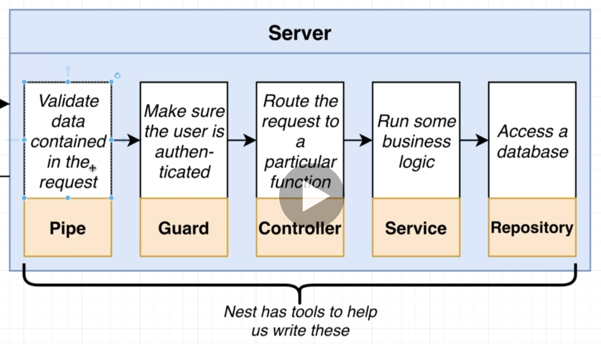
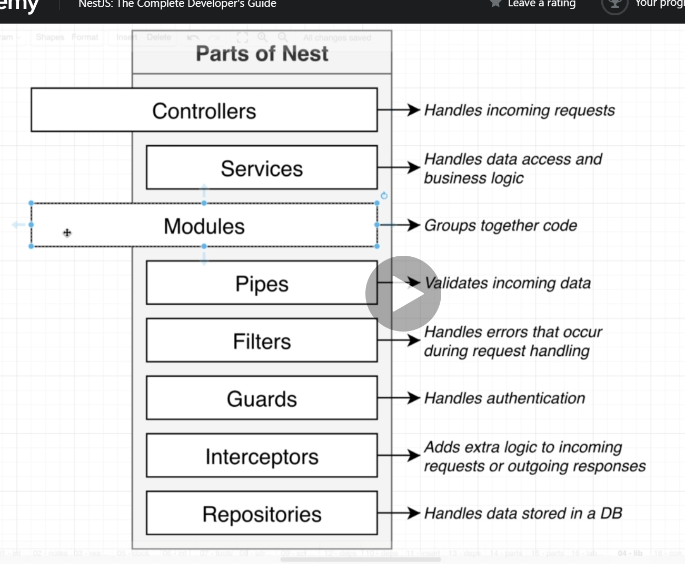

# Notes

7/28/2021

Initial npm modules:

```json
    // Contains vast majority of functions, classes, etc,
    // that we need from Nest
    "@nestjs/common": "^7.6.17",
    "@nestjs/core": "^7.6.17",
    // Lets Nest use Express JS for handling HTTP requests
    "@nestjs/platform-express": "^7.6.17",
    // helps make decorators work. more on this soon!
    "reflect-metadata": "^0.1.13",
    "typescript": "^4.3.2"
```

NestJS requires Express or Fastify to handle the actual http requests. By default express is used.



